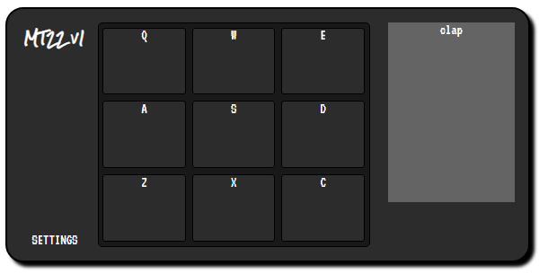

# Front End Libraries Projects - Build a Drum Machine

## Objective
Build a CodePen.io app that is functionally similar to this: https://codepen.io/freeCodeCamp/full/MJyNMd.
A list of user stories for passing the test can be found [here](https://learn.freecodecamp.org/front-end-libraries/front-end-libraries-projects/build-a-drum-machine).

## How to run
Follow the steps below to run the project:
1. make sure you have NPM installed
2. clone the project using `git clone https://github.com/electrovagance/neighborhood-map.git` in your console
3. install yarn using `yarn install` in your console
4. install project dependencies using `yarn add` (see dependencies below)
5. start the development server with `yarn start`
6. app will be hosted locally (i.e., `http://localhost:3000` in your browser)

## Todos
* Finish styling (pads, pad click, and display)
* Add a power switch

